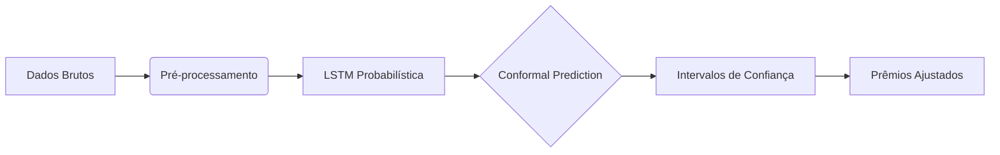

# 🏆Previsão de Sinistralidade com Conformal Prediction


Projeto premiado pelo **Instituto Brasileiro de Atuária** desenvolvido por José Alisson Alves Ursulino e Francisco Juanito Costa da Silva, apresentando uma abordagem inovadora para precificação de seguros usando LSTM e Conformal Prediction.

## 🔍 Resumo do Trabalho

📜 **Abstract**  

> "Este trabalho apresenta uma abordagem inovadora para a previsão de sinistralidades utilizando a técnica de **Conformal Prediction (CP)**. O CP é uma técnica **não-paramétrica** e **independente do modelo preditivo**, permitindo sua aplicação em uma ampla gama de modelos, como os *GLM* amplamente utilizados pelos atuários. 
> 
> Neste estudo, optamos por aplicar o CP sobre redes neurais, utilizando especificamente uma Rede Neural Recorrente do tipo **Long Short-Term Memory (LSTM) Probabilística** para capturar a dinâmica temporal dos sinistros agregados diariamente. Ao contrário de métodos tradicionais, que assumem distribuições predefinidas para os dados, o CP ajusta-se ao comportamento dos dados, fornecendo intervalos de confiança robustos e adaptáveis às previsões de sinistros.  
> 
> Nos resultados empíricos, demonstramos que a aplicação do CP no conjunto de teste proporcionou maior cobertura e proteção, ajustando os prêmios puros de maneira proativa com base na incerteza dos sinistros. Com isso, foi proposto um parâmetro de sensibilidade flexível $\alpha$, que permite calibrar o prêmio conforme diferentes níveis de aversão ao risco. 
> 
> A principal vantagem deste método é sua simplicidade e facilidade de implementação, uma vez que ele pode ser incorporado diretamente aos modelos preexistentes de seguradoras, sem a necessidade de reformulações estruturais. 
> 
> Essa abordagem oferece uma solução eficaz para mitigar ou assumir riscos e melhorar a precificação em cenários de alta variabilidade e incerteza, contribuindo para um cálculo mais justo e adaptado à realidade dos sinistros observados."

### 🎯 Contribuições Principais

1. **Framework Robusto**  
   
   - CP como ferramenta independente de distribuições pré-definidas
   - Intervalos de confiança adaptativos para sinistros diários

2. **Inovação Metodológica**  
   
   - Integração de LSTM Probabilística + CP
   - Parâmetro de sensibilidade flexível (α) para aversão ao risco

3. **Aplicações Práticas**  
   
   - Cálculo dinâmico de prêmios puros
   - Mitigação de riscos em cenários de alta incerteza

## 🛠️ Implementação Técnica

### 📊 Fluxo do Projeto



### 📚 Dependências

```bash
conda create -n iba_env python=3.10
conda activate iba_env
conda install -c conda-forge -c pytorch u8darts-all
```

## 🗂️ Estrutura do Código

```
IBA_PureRiskConformal/
|── data/
|   |── external
|   |── interin
|   |── processed # Salva os dados combinados, tratados e processados
|   |── raw
|       |── susep fonte: # Dados brutos *dados disponíveis no link abaixo
├── notebooks/
│   ├── treatment.ipynb       # Pré-processamento com make_dataset.py
│   ├── training_model.ipynb  # LSTM + Optuna
│   └── results.ipynb         # Análise CP e métricas
├── src/
│   └── data/ 
│       └── make_dataset.py   # Pipeline de dados
└── reports/figures/          # Visualizações publicáveis
```

## 📌 Como Reproduzir

1. Pré-processamento:
   
   ```bash
   jupyter notebook notebooks/treatment.ipynb
   ```

2. Modelagem:
   
   ```bash
   jupyter notebook notebooks/training_model.ipynb
   ```

3. Análise:
   
   ```bash
   jupyter notebook notebooks/results.ipynb
   ```

## 📄 Publicação

Trabalho completo disponível na [Revista Brasileira de Atuária]([Lançamento da 8ª Edição da Revista Brasileira de Atuária – Instituto Brasileiro de Atuária (IBA)](https://atuarios.org.br/lancamento-da-8a-edicao-da-revista-brasileira-de-atuaria/))

dados: [susep](https://drive.google.com/drive/folders/16x1l02dqg4EII7Q4bDgZe34wEWB99XGv?usp=sharing)

---

*Projeto desenvolvido por José Alisson Alves Ursulino | Premiado pelo Institudo Brasileiro de Atuária (IBA)*

contato: 

[linkedin](www.linkedin.com/in/alisson-ursulino-a746471a4), [email](alisson.atuario@gmail.com)


